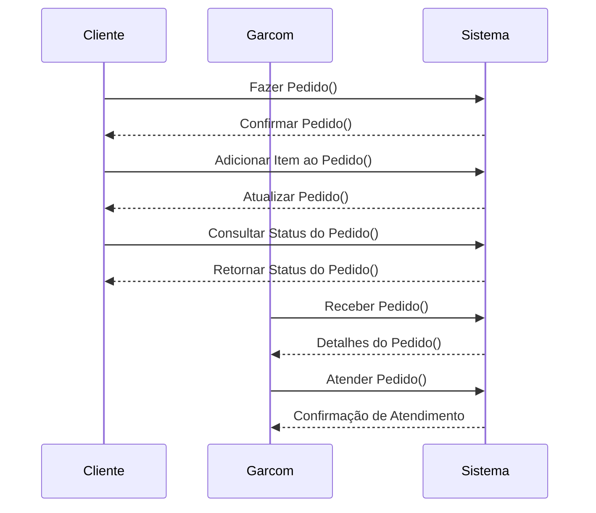
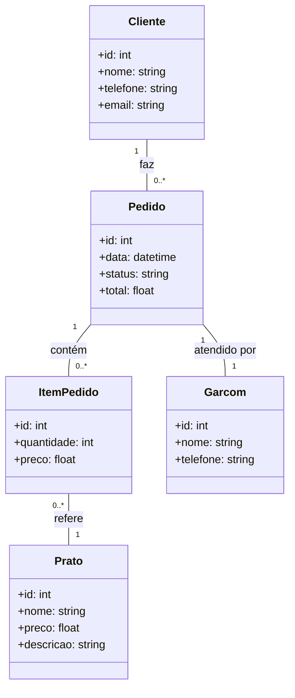
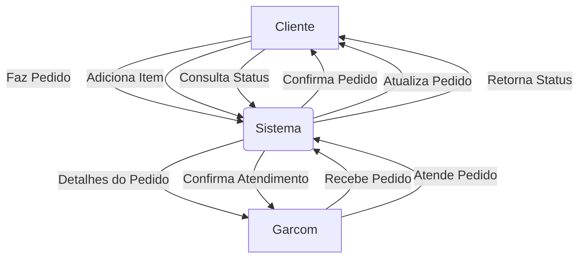
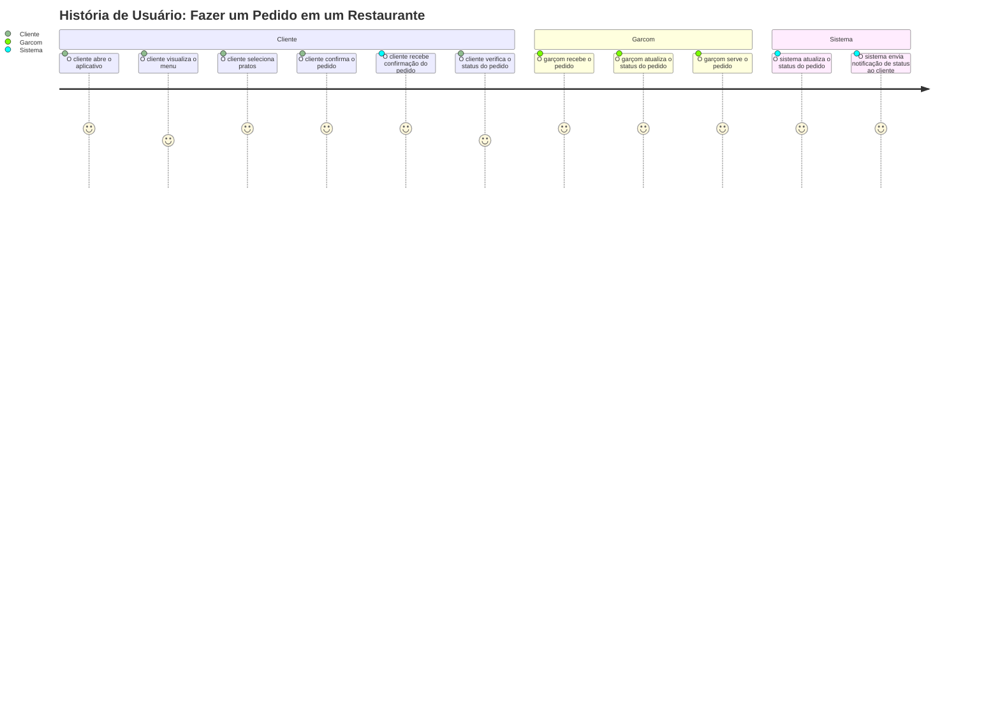

# 1 - Diagrama de Sequência

```mermaid
%%{ init : { "theme" : "default" } }%%
sequenceDiagram
    participant Cliente
    participant Garcom
    participant Sistema

    Cliente->>Sistema: Fazer Pedido()
    Sistema-->>Cliente: Confirmar Pedido()

    Cliente->>Sistema: Adicionar Item ao Pedido()
    Sistema-->>Cliente: Atualizar Pedido()

    Cliente->>Sistema: Consultar Status do Pedido()
    Sistema-->>Cliente: Retornar Status do Pedido()

    Garcom->>Sistema: Receber Pedido()
    Sistema-->>Garcom: Detalhes do Pedido()

    Garcom->>Sistema: Atender Pedido()
    Sistema-->>Garcom: Confirmação de Atendimento
```

# 2 - Diagrama de classe

```mermaid
classDiagram
class Cliente {
+id: int
+nome: string
+telefone: string
+email: string
}

    class Pedido {
        +id: int
        +data: datetime
        +status: string
        +total: float
    }

    class ItemPedido {
        +id: int
        +quantidade: int
        +preco: float
    }

    class Prato {
        +id: int
        +nome: string
        +preco: float
        +descricao: string
    }

    class Garcom {
        +id: int
        +nome: string
        +telefone: string
    }

    Cliente "1" -- "0..*" Pedido : faz
    Pedido "1" -- "0..*" ItemPedido : contém
    ItemPedido "0..*" -- "1" Prato : refere
    Pedido "1" -- "1" Garcom : atendido por
```

# 3 - Diagrama compartilhados

```mermaid
%%{ init : { "theme" : "default" } }%%
graph TD
    A[Cliente] -->|Faz Pedido| B(Sistema)
    B -->|Confirma Pedido| A
    A -->|Adiciona Item| B
    B -->|Atualiza Pedido| A
    A -->|Consulta Status| B
    B -->|Retorna Status| A
    C[Garcom] -->|Recebe Pedido| B
    B -->|Detalhes do Pedido| C
    C -->|Atende Pedido| B
    B -->|Confirma Atendimento| C
```

# 4 - Historia de usuario

```mermaid
journey
title História de Usuário: Fazer um Pedido em um Restaurante
section Cliente
O cliente abre o aplicativo: 5: Cliente
O cliente visualiza o menu: 4: Cliente
O cliente seleciona pratos: 5: Cliente
O cliente confirma o pedido: 5: Cliente
O cliente recebe confirmação do pedido: 5: Sistema
O cliente verifica o status do pedido: 4: Cliente
section Garcom
O garçom recebe o pedido: 5: Garcom
O garçom atualiza o status do pedido: 5: Garcom
O garçom serve o pedido: 5: Garcom
section Sistema
O sistema atualiza o status do pedido: 5: Sistema
O sistema envia notificação de status ao cliente: 5: Sistema
```
